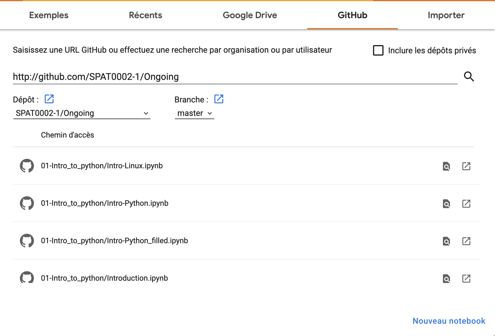

# Lectures

This folder gathers the I-Python notebooks used for the lecture SPAT0002-1.   
**Read the notebooks**:

- [Index.ipynb](Index.ipynb) for a handy Index of the content of the various notebooks.
- [Introduction.ipynb](Introduction.ipynb) to understand how the course works in practice.
- [Test_config.ipynb](Test_config.ipynb) to see if you have installed the packages required for the lecture.

The reference book (lecture notes) associated to this lecture is:

Statistics, Data Mining and Machine Learning in Astronomy',
Ivezic, Connolly, VanderPlas, and Gray, 2012 (Princeton University Press) (http://www.astroml.org/)

Details on the chapters of the book covered by this lecture will be given at the end of each Notebook.
The Notebooks themselves constitute the other recommended learning support for this class. 

A quick guide for installing python on your computer is available in the notebook [Install_python.ipynb](Install_python.ipynb)

In case you have trouble with your local installation, a temporary backup solution consists in using google colab.
You may launch the following https://colab.research.google.com/ .

A window similar to the one below (the language might of the page might be different) should be available. In the menu `GitHub`, you can simply copy-paste the link of the github of the lecture https://github.com/SPAT0002-1/Ongoing

For a detailed introduction to Version Control Systems:

- Software Carpenty: http://swcarpentry.github.io/git-novice/
- The Pro-GIT book written by Scott Chacon and Ben Straub and published by Apress (Mostly Chap 1-4):
[https://git-scm.com/book/fr/v2](https://git-scm.com/book/fr/v2)

Additional references will be given at the end of most of the Notebooks. 
